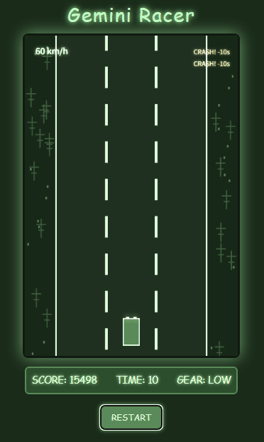

# Gemini Racer
 

## 公開ページ
[https://keigox68000.github.io/GeminiRacer/](https://keigox68000.github.io/GeminiRacer/) 

## これはなに？

ライバル車が走るハイウェイを駆け抜ける、レトロスタイルの縦スクロールレーシングゲームです。
キーボードで車を操り、ハイスコアを目指しましょう。

## ルール

- **操作:**
    - `矢印キー左右`: ハンドル操作
    - `Zキー`: アクセル
    - `Xキー`: ギアチェンジ (LOW / HIGH)
- **ゲーム目的:**
    - 制限時間内にできるだけ多くのスコアを獲得します。
    - 他の車との衝突を避けてください。
    - 道路外を走行すると大幅に減速します。
- **スコアリング:**
    - 速度を出して走行することでスコアが加算されます。
    - 一定スコアを獲得するごとにタイムボーナス (`+5秒`) が与えられます (初期閾値: 5000点ごと)。
- **時間:**
    - 初期持ち時間は `30秒` です。
    - スコアによるタイムボーナスの他に、他の車に衝突するとタイムペナルティ (`-10秒`) があり、一定時間操作不能になります。
- **ギアシステム:**
    - `LOWギア`: 発進時や低速域での加速力に優れます。最高速度は `120km/h` 程度に制限されます。
    - `HIGHギア`: 高速走行に適していますが (`MAX 300km/h`)、低速からの加速は鈍くなります。
    - 高速走行中に `HIGHギア` から `LOWギア` にシフトダウンすると、エンジンブレーキがかかり効果的に減速します（目標速度 `100km/h`）。
- **ゲームオーバー:**
    - 持ち時間が `0` になるとゲームオーバーです。
    - クラッシュ時のタイムペナルティで持ち時間が `0` 以下になった場合もゲームオーバーとなります。

Good Luck!